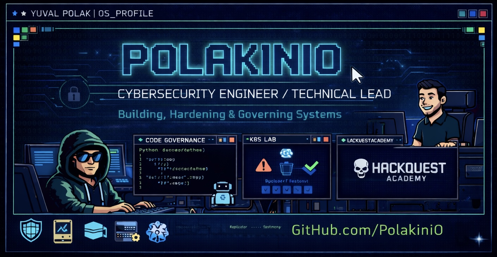
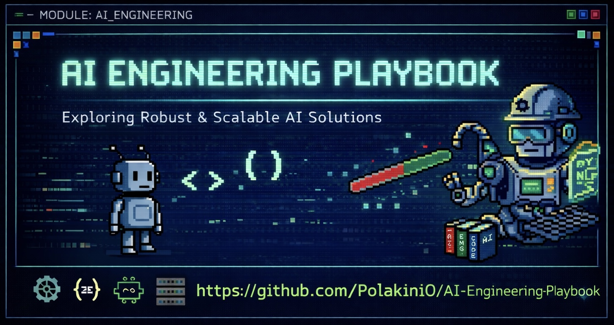
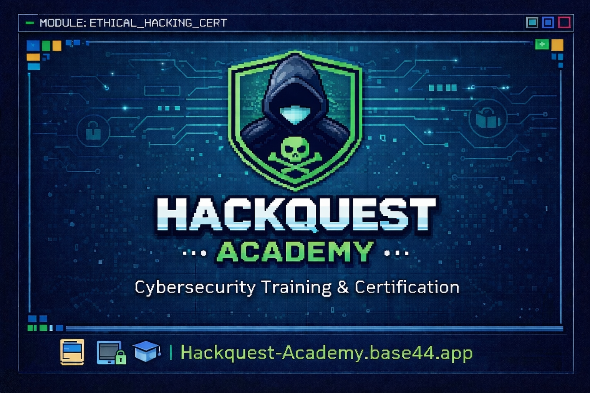
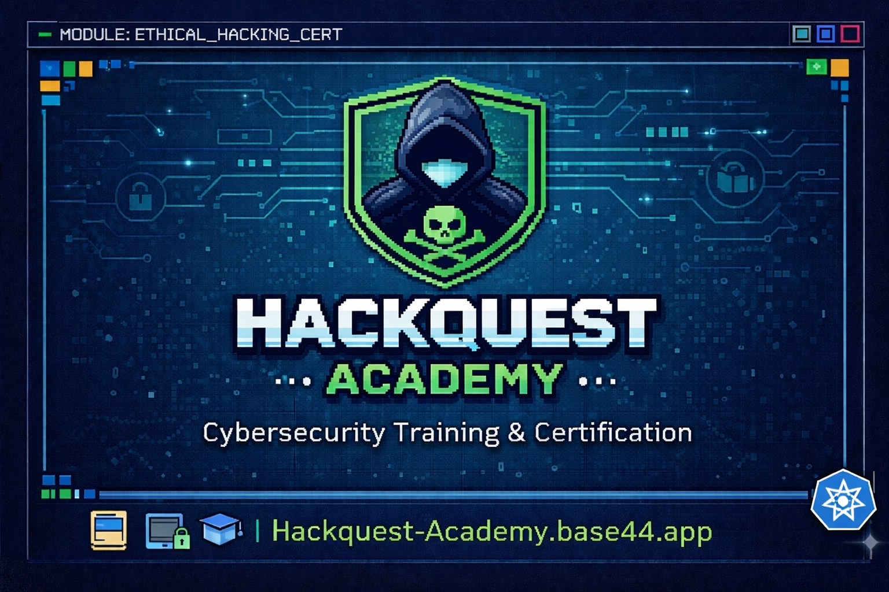

  

# Yuval Polak
### Cybersecurity Engineer / Technical Lead
⚡ Building security tools, engineering systems, and governing how AI writes code

I work on security the way it actually behaves in production: messy, interconnected, and usually one bad assumption away from breaking.

I build, troubleshoot, harden, automate, and tear systems apart until the weak spots show up.

---

## About Me

- Cybersecurity Technical Lead with 5+ years of hands-on engineering experience across technology, finance, government, defense, and other enterprise environments.
- Focused on security architecture, engineering, and what really happens when controls meet production.
- Deep into DLP, SSE, SASE, cloud security, detection engineering, endpoint protection, and BAS.
- Used to operating in real enterprise environments across 50+ organizations, not isolated demo labs.
- Strong bias for troubleshooting, root cause analysis, secure integration, and understanding system behavior under pressure.
- I also build personal tools and side projects because good ideas usually start by solving annoying real problems.

Worked across 50+ enterprise environments, dealing with real systems, real constraints, and real failures.

---

## Tech Stack

---

## GitHub Stats

---

## Projects

### [AI-Engineering-Playbook](https://github.com/PolakiniO/AI-Engineering-Playbook)

Built a governance framework that makes AI coding agents (such as Codex and similar tools) behave like disciplined senior engineers when interacting with a codebase.

Instead of ad-hoc prompts and inconsistent outputs, it introduces a reusable layer that standardizes implementation, refactoring, and code review across repositories.

Key capabilities:
- Repository-level governance using AGENTS.md
- Structured workflows via a portable playbook system
- Reusable skill modules for consistent AI behavior
- Enforced output structure for code reviews and implementations
- Separation between generic governance and repo-specific logic
- Support for multiple use cases (security workflows, backend services, data pipelines)
- Presentation-ready output modes for demos and documentation
- Designed to work across AI agents, tested primarily with Codex

Designed as a drop-in layer that can be adopted without modifying runtime code or introducing dependencies.

The project reflects a shift from using AI as a helper to treating it as an engineer operating within defined boundaries, contracts, and review standards.

---

### [HackQuest Academy](https://hackquest-academy.base44.app)

Built a gamified offensive security learning platform in ~3 days, designed to make hands-on cybersecurity practice accessible directly from a mobile device and browser.

The project started from a simple question: can offensive security be practiced meaningfully from a phone? HackQuest Academy answers that by turning training into an interactive, game-like experience instead of a static lesson library.

Key capabilities:
- Structured learning paths with progressive difficulty
- Interactive challenges, quizzes, and CTF-style missions
- Simulated terminal experience directly in the browser
- Gamification system with XP, levels, streaks, and skill trees
- Leaderboards and public user profiles
- Completion certificates for learning tracks
- Fully mobile-first design with no installation required
- AI-assisted content generation and AI Tutor support
- Feedback systems, issue reporting, and an internal AIFixLog improvement loop
- Dynamic curriculum architecture for extending tracks without structural rewrites

The project reflects rapid prototyping, product thinking, and using AI to accelerate both development and content creation.

---

### [MacMountSMB](https://github.com/PolakiniO/MacMountSMB)

Built a lightweight macOS utility that automatically restores SMB mounts, reducing disruptions caused by sleep, network changes, and VPN reconnects.

What began as a personal workaround evolved into a more polished tool focused not just on reconnecting shares, but on making installation, day-to-day use, troubleshooting, and clean removal practical for real users.

Key capabilities:
- Automatic SMB reconnection with smart connectivity checks
- Interactive and flag-based installation flows
- Native macOS LaunchAgent integration
- Finder and Keychain usage for secure credential handling
- Runs fully in user space without sudo or system modifications
- Clean uninstall with no leftover artifacts
- Logging and debugging support for transparency and troubleshooting

The project highlights the shift from a script that works on one machine to a tool others can install, trust, and remove with confidence.

---

### [WTouch](https://github.com/PolakiniO/WTouch)

Built a lightweight native Windows alternative to the Linux `touch` command, eliminating the need to switch to WSL for simple file creation and timestamp operations.

The tool is primarily implemented in C++ with the Win32 API, with an emphasis on performance, full Unicode support, precise timestamp handling, and a standalone user experience without external dependencies.

Key capabilities:
- Create new files or update timestamps on existing ones
- Fine-grained control over access and modification times
- Copy timestamps from reference files
- Support ISO and POSIX-style timestamp formats
- Work with files, directories, and Windows wildcards
- Fully standalone operation with no external dependencies
- Additional implementations in C, Python, and Bash for portability and simplicity

The development process also leveraged OpenAI Codex, requiring careful prompt engineering and precise requirement definition while building in a low-level language.

---

### [CyberFolio](https://polakinio.com/)

Built an interactive portfolio website that simulates a full operating system environment, creating a unique and immersive way to explore professional experience and projects.

CyberFolio combines a graphical desktop interface with a command-line experience, allowing users to navigate the portfolio in multiple ways, similar to a real OS.

Key capabilities:
- Desktop-like environment with dynamic taskbar and draggable windows
- Matrix-inspired background for a cyber-themed experience
- Fully interactive GUI with resizable application windows
- Built-in terminal for command-line navigation
- Hybrid interaction model combining CLI and GUI
- Included applications for About Me, Experience, Skills, Projects, Education, Certifications, Military Service, Contact Me, and an embedded web browser

The project focuses on creating a memorable user experience while showcasing technical skills, blending frontend development with system-inspired design.

---

### [K8S-zero-to-hero](https://github.com/PolakiniO/K8S-Zero-To-Hero)

Built a hands-on Kubernetes learning repository focused on real troubleshooting, progressive labs, operational repetition, and platform/security thinking instead of passive theory.

The project started as a personal knowledgebase and lab environment, then evolved into a structured public repo designed to teach Kubernetes the way it behaves in practice: through failure, debugging, verification, and repetition.

Key capabilities:
- Structured Kubernetes notes and guided learning material
- Progressive hands-on labs across core operations, networking, and deployment scenarios
- Capstone exercises focused on platform, security, and verification workflows
- Troubleshooting-first learning model built around proving failures and validating fixes
- Supporting scripts and manifests for reproducible practice
- Security and release guardrails for keeping the repository safe to maintain publicly
- Public-facing documentation, contribution guidance, and repo hardening for open collaboration

The project reflects the same mindset I bring to security engineering: systems are understood best when you break them, observe them carefully, and explain exactly why they failed.

---

### [PolakiniO](https://github.com/PolakiniO/PolakiniO)

Built my GitHub profile repository as a living technical portfolio that combines personal branding, engineering credibility, and project storytelling in one public-facing hub.

Instead of a minimal profile README, it is structured as a continuously maintained showcase covering professional focus, core technical stack, validated project work, and hands-on delivery mindset.

Key capabilities:
- Structured profile architecture with clear sections for About, Tech Stack, Projects, Skills, and Mindset
- Dynamic GitHub statistics and language/activity cards for transparent public signal
- Project documentation style focused on practical outcomes, implementation details, and engineering tradeoffs
- Consistent writing framework for turning technical work into portfolio-ready narratives
- Integrated visual assets and badges for fast scanning and recruiter-friendly readability
- Living update model with timestamped maintenance and continuous refinement

The repository reflects an approach to personal branding where technical communication, execution quality, and proof of work are treated as part of the engineering deliverable.

---

## Skills

### Security Engineering & Architecture
- Secure architecture design
- Detection engineering
- DLP policy design and optimization
- Breach and Attack Simulation (BAS)
- Threat simulation and validation
- Cloud security (AWS, SSE, SASE)
- Security controls design and hardening

### Automation, Scripting & Tools
- Python
- PowerShell
- Bash / shell scripting
- API integration and automation
- Security tool development
- Git / version control

### Infrastructure, Systems & Networking
- Enterprise networking and firewall architecture
- Windows and Linux server administration
- Virtualization (VMware)
- Active Directory and enterprise services
- Endpoint and network protection
- Hybrid and on-prem environments

### Implementation & Technical Delivery
- Complex system integration
- Technical troubleshooting and root cause analysis
- High- and low-level design (HLD / LLD)
- Technical documentation and architecture diagrams

### Leadership & Collaboration
- Technical project leadership
- Engineering mentoring
- Cross-functional collaboration
- Professional services delivery

---

## Mindset

- Build things that solve real friction.
- Security should survive contact with production.
- If a tool looks good but fails under load, edge cases, or bad assumptions, it is not done.
- Understanding behavior matters more than memorizing features.
- I like systems you can trust, scripts that earn their keep, and troubleshooting that ends with a root cause.

---

> <!-- last update note -->
> **// Last updated:** 2026-03-31
